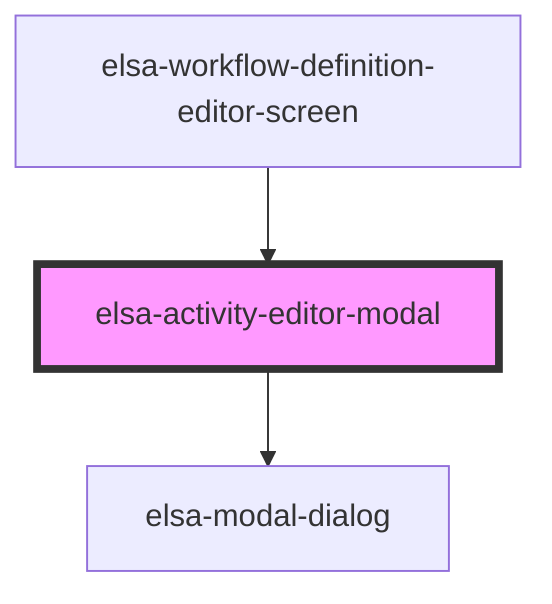

# elsa-activity-editor-modal

<!-- Auto Generated Below -->

## Dependencies

### Used by

 - [elsa-workflow-definition-editor-screen](../elsa-workflow-definition-editor-screen)

### Depends on

- [elsa-modal-dialog](../../../shared/elsa-modal-dialog)

### Graph

----------------------------------------------

*Built with [StencilJS](https://stenciljs.com/)*
