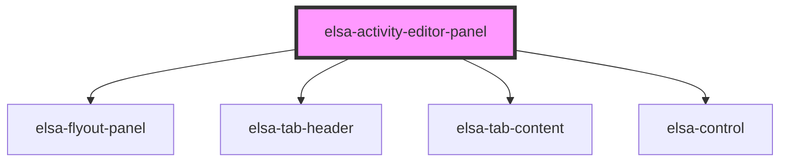

# elsa-activity-editor-panel

<!-- Auto Generated Below -->

## Properties

| Property  | Attribute | Description | Type     | Default     |
| --------- | --------- | ----------- | -------- | ----------- |
| `culture` | `culture` |             | `string` | `undefined` |

## Dependencies

### Depends on

- [elsa-flyout-panel](../../../shared/elsa-flyout-panel)
- [elsa-tab-header](../../../shared/elsa-tab-header)
- [elsa-tab-content](../../../shared/elsa-tab-content)
- [elsa-control](../../../controls/elsa-control)

### Graph

----------------------------------------------

*Built with [StencilJS](https://stenciljs.com/)*
