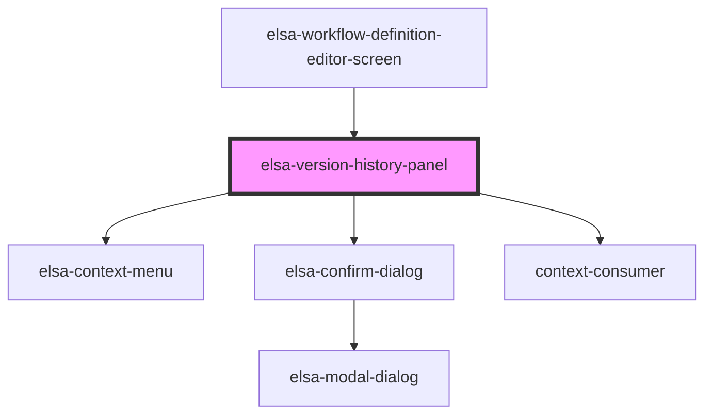

# elsa-version-history-panel

<!-- Auto Generated Below -->

## Properties

| Property             | Attribute    | Description | Type                 | Default     |
| -------------------- | ------------ | ----------- | -------------------- | ----------- |
| `serverUrl`          | `server-url` |             | `string`             | `undefined` |
| `workflowDefinition` | --           |             | `WorkflowDefinition` | `undefined` |

## Events

| Event                  | Description | Type                                     |
| ---------------------- | ----------- | ---------------------------------------- |
| `deleteVersionClicked` |             | `CustomEvent<WorkflowDefinitionVersion>` |
| `revertVersionClicked` |             | `CustomEvent<WorkflowDefinitionVersion>` |
| `versionSelected`      |             | `CustomEvent<WorkflowDefinitionVersion>` |

## Dependencies

### Used by

 - [elsa-workflow-definition-editor-screen](../elsa-workflow-definition-editor-screen)

### Depends on

- [elsa-context-menu](../../../controls/elsa-context-menu)
- [elsa-confirm-dialog](../../../shared/elsa-confirm-dialog)
- context-consumer

### Graph

----------------------------------------------

*Built with [StencilJS](https://stenciljs.com/)*
