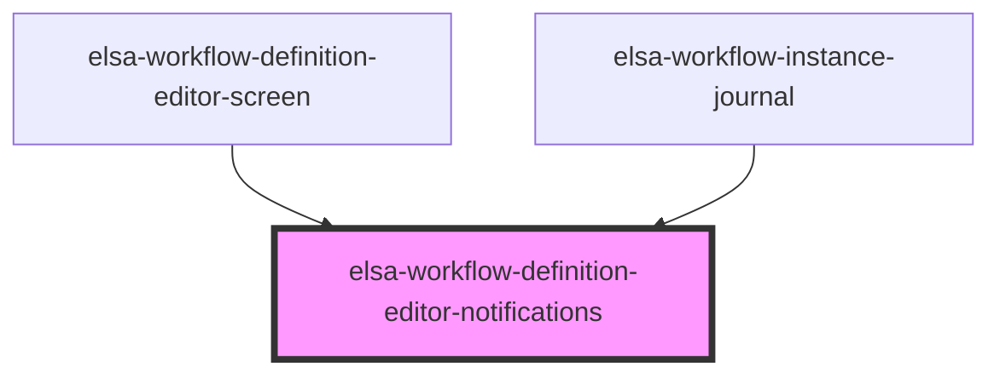

# elsa-activity-picker-modal

<!-- Auto Generated Below -->

## Dependencies

### Used by

 - [elsa-workflow-definition-editor-screen](../elsa-workflow-definition-editor-screen)
 - [elsa-workflow-instance-journal](../../workflow-instance-viewer/elsa-workflow-instance-journal)

### Graph

----------------------------------------------

*Built with [StencilJS](https://stenciljs.com/)*
