# elsa-workflow-definition-editor

<!-- Auto Generated Below -->

## Properties

| Property               | Attribute                | Description | Type            | Default     |
| ---------------------- | ------------------------ | ----------- | --------------- | ----------- |
| `basePath`             | `base-path`              |             | `string`        | `undefined` |
| `culture`              | `culture`                |             | `string`        | `undefined` |
| `features`             | `features`               |             | `string`        | `undefined` |
| `history`              | --                       |             | `RouterHistory` | `undefined` |
| `monacoLibPath`        | `monaco-lib-path`        |             | `string`        | `undefined` |
| `serverFeatures`       | --                       |             | `string[]`      | `[]`        |
| `serverUrl`            | `server-url`             |             | `string`        | `undefined` |
| `workflowDefinitionId` | `workflow-definition-id` |             | `string`        | `undefined` |

## Events

| Event           | Description | Type                              |
| --------------- | ----------- | --------------------------------- |
| `workflowSaved` |             | `CustomEvent<WorkflowDefinition>` |

## Methods

### `exportWorkflow() => Promise<void>`

#### Returns

Type: `Promise<void>`

### `getServerUrl() => Promise<string>`

#### Returns

Type: `Promise<string>`

### `getWorkflowDefinitionId() => Promise<string>`

#### Returns

Type: `Promise<string>`

### `importWorkflow(file: File) => Promise<void>`

#### Returns

Type: `Promise<void>`

## Dependencies

### Used by

 - [elsa-studio-workflow-definitions-edit](../../../dashboard/pages/elsa-studio-workflow-definitions-edit)

### Depends on

- [elsa-workflow-fault-information](../../../shared/elsa-workflow-debug-information)
- [elsa-workflow-performance-information](../../../shared/elsa-workflow-debug-information)
- [elsa-tab-header](../../../shared/elsa-tab-header)
- [elsa-tab-content](../../../shared/elsa-tab-content)
- [elsa-designer-panel](../../../shared/elsa-designer-panel)
- [elsa-version-history-panel](../elsa-version-history-panel)
- [elsa-modal-dialog](../../../shared/elsa-modal-dialog)
- [elsa-monaco](../../../controls/elsa-monaco)
- [elsa-designer-tree](../../../designers/tree/elsa-designer-tree)
- [x6-designer](../../../designers/x6-designer)
- [elsa-workflow-settings-modal](../elsa-workflow-settings-modal)
- [elsa-workflow-definition-editor-notifications](../elsa-workflow-definition-editor-notifications)
- [elsa-confirm-dialog](../../../shared/elsa-confirm-dialog)
- [elsa-activity-picker-modal](../elsa-activity-picker-modal)
- [elsa-activity-editor-modal](../elsa-activity-editor-modal)
- [elsa-workflow-publish-button](../elsa-workflow-publish-button)
- [elsa-flyout-panel](../../../shared/elsa-flyout-panel)
- [elsa-workflow-properties-panel](../elsa-workflow-properties-panel)
- [elsa-workflow-test-panel](../elsa-workflow-test-panel)
- context-consumer

### Graph

```mermaid
graph TD;
  elsa-workflow-definition-editor-screen --> elsa-workflow-fault-information
  elsa-workflow-definition-editor-screen --> elsa-workflow-performance-information
  elsa-workflow-definition-editor-screen --> elsa-tab-header
  elsa-workflow-definition-editor-screen --> elsa-tab-content
  elsa-workflow-definition-editor-screen --> elsa-designer-panel
  elsa-workflow-definition-editor-screen --> elsa-version-history-panel
  elsa-workflow-definition-editor-screen --> elsa-modal-dialog
  elsa-workflow-definition-editor-screen --> elsa-monaco
  elsa-workflow-definition-editor-screen --> elsa-designer-tree
  elsa-workflow-definition-editor-screen --> x6-designer
  elsa-workflow-definition-editor-screen --> elsa-workflow-settings-modal
  elsa-workflow-definition-editor-screen --> elsa-workflow-definition-editor-notifications
  elsa-workflow-definition-editor-screen --> elsa-confirm-dialog
  elsa-workflow-definition-editor-screen --> elsa-activity-picker-modal
  elsa-workflow-definition-editor-screen --> elsa-activity-editor-modal
  elsa-workflow-definition-editor-screen --> elsa-workflow-publish-button
  elsa-workflow-definition-editor-screen --> elsa-flyout-panel
  elsa-workflow-definition-editor-screen --> elsa-workflow-properties-panel
  elsa-workflow-definition-editor-screen --> elsa-workflow-test-panel
  elsa-workflow-definition-editor-screen --> context-consumer
  elsa-version-history-panel --> elsa-context-menu
  elsa-version-history-panel --> elsa-confirm-dialog
  elsa-version-history-panel --> context-consumer
  elsa-confirm-dialog --> elsa-modal-dialog
  elsa-workflow-settings-modal --> elsa-modal-dialog
  elsa-workflow-settings-modal --> elsa-monaco
  elsa-activity-picker-modal --> elsa-modal-dialog
  elsa-activity-editor-modal --> elsa-modal-dialog
  elsa-activity-editor-modal --> elsa-control
  elsa-workflow-publish-button --> context-consumer
  elsa-workflow-properties-panel --> context-consumer
  elsa-workflow-test-panel --> elsa-copy-button
  elsa-workflow-test-panel --> elsa-confirm-dialog
  elsa-workflow-test-panel --> context-consumer
  elsa-studio-workflow-definitions-edit --> elsa-workflow-definition-editor-screen
  style elsa-workflow-definition-editor-screen fill:#f9f,stroke:#333,stroke-width:4px
```

----------------------------------------------

*Built with [StencilJS](https://stenciljs.com/)*
