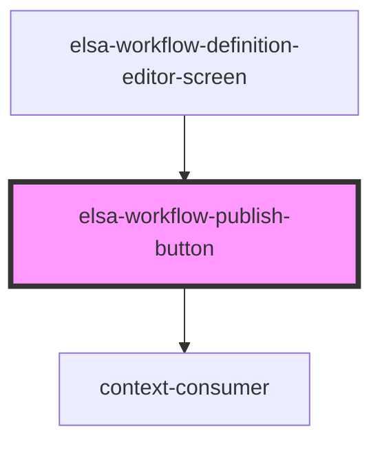

# elsa-activity-picker-modal

<!-- Auto Generated Below -->

## Properties

| Property             | Attribute    | Description | Type                 | Default     |
| -------------------- | ------------ | ----------- | -------------------- | ----------- |
| `culture`            | `culture`    |             | `string`             | `undefined` |
| `publishing`         | `publishing` |             | `boolean`            | `undefined` |
| `workflowDefinition` | --           |             | `WorkflowDefinition` | `undefined` |

## Events

| Event              | Description | Type                |
| ------------------ | ----------- | ------------------- |
| `deleteClicked`    |             | `CustomEvent<any>`  |
| `exportClicked`    |             | `CustomEvent<any>`  |
| `importClicked`    |             | `CustomEvent<File>` |
| `publishClicked`   |             | `CustomEvent<any>`  |
| `revertClicked`    |             | `CustomEvent<any>`  |
| `unPublishClicked` |             | `CustomEvent<any>`  |

## Dependencies

### Used by

 - [elsa-workflow-definition-editor-screen](../elsa-workflow-definition-editor-screen)

### Depends on

- context-consumer

### Graph

----------------------------------------------

*Built with [StencilJS](https://stenciljs.com/)*
