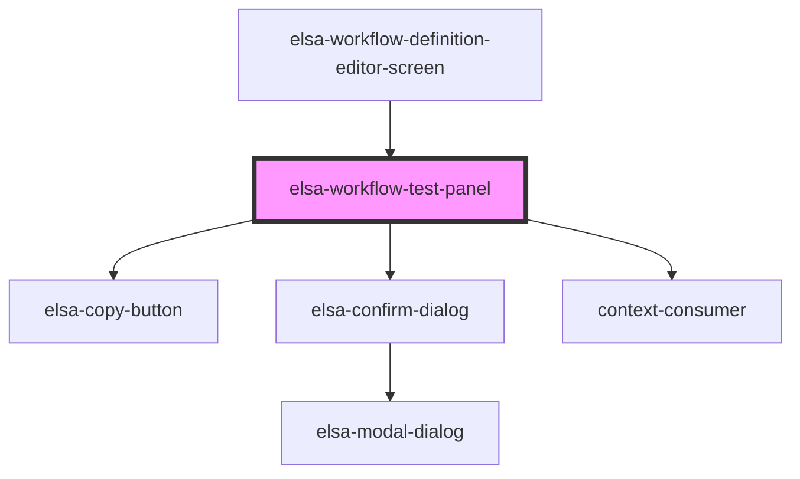

# elsa-workflow-test-panel

<!-- Auto Generated Below -->

## Properties

| Property                 | Attribute                   | Description | Type                 | Default     |
| ------------------------ | --------------------------- | ----------- | -------------------- | ----------- |
| `culture`                | `culture`                   |             | `string`             | `undefined` |
| `selectedActivityId`     | `selected-activity-id`      |             | `string`             | `undefined` |
| `serverUrl`              | `server-url`                |             | `string`             | `undefined` |
| `workflowDefinition`     | --                          |             | `WorkflowDefinition` | `undefined` |
| `workflowTestActivityId` | `workflow-test-activity-id` |             | `string`             | `undefined` |

## Dependencies

### Used by

 - [elsa-workflow-definition-editor-screen](../elsa-workflow-definition-editor-screen)

### Depends on

- [elsa-copy-button](../../../shared/elsa-copy-button)
- [elsa-confirm-dialog](../../../shared/elsa-confirm-dialog)
- context-consumer

### Graph

----------------------------------------------

*Built with [StencilJS](https://stenciljs.com/)*
