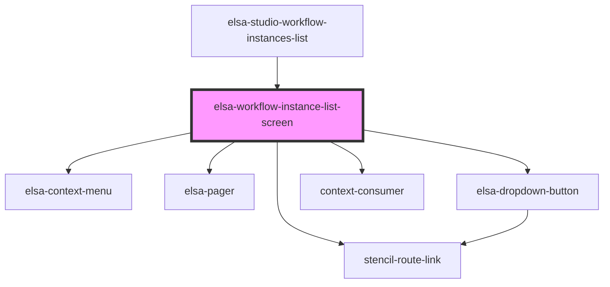

# elsa-workflow-instances-list-screen

<!-- Auto Generated Below -->

## Properties

| Property         | Attribute         | Description | Type                                                                                                                                                         | Default           |
| ---------------- | ----------------- | ----------- | ------------------------------------------------------------------------------------------------------------------------------------------------------------ | ----------------- |
| `basePath`       | `base-path`       |             | `string`                                                                                                                                                     | `undefined`       |
| `correlationId`  | `correlation-id`  |             | `string`                                                                                                                                                     | `undefined`       |
| `culture`        | `culture`         |             | `string`                                                                                                                                                     | `undefined`       |
| `history`        | --                |             | `RouterHistory`                                                                                                                                              | `undefined`       |
| `orderBy`        | `order-by`        |             | `OrderBy.Finished \| OrderBy.LastExecuted \| OrderBy.Started`                                                                                                | `OrderBy.Started` |
| `serverUrl`      | `server-url`      |             | `string`                                                                                                                                                     | `undefined`       |
| `workflowId`     | `workflow-id`     |             | `string`                                                                                                                                                     | `undefined`       |
| `workflowStatus` | `workflow-status` |             | `WorkflowStatus.Cancelled \| WorkflowStatus.Faulted \| WorkflowStatus.Finished \| WorkflowStatus.Idle \| WorkflowStatus.Running \| WorkflowStatus.Suspended` | `undefined`       |

## Methods

### `getSelectedWorkflowInstanceIds() => Promise<string[]>`

#### Returns

Type: `Promise<string[]>`

### `refresh() => Promise<void>`

#### Returns

Type: `Promise<void>`

## Dependencies

### Used by

 - [elsa-studio-workflow-instances-list](../../../dashboard/pages/elsa-studio-workflow-instances-list)

### Depends on

- stencil-route-link
- [elsa-context-menu](../../../controls/elsa-context-menu)
- [elsa-pager](../../../controls/elsa-pager)
- [elsa-dropdown-button](../../../controls/elsa-dropdown-button)
- context-consumer

### Graph

----------------------------------------------

*Built with [StencilJS](https://stenciljs.com/)*
