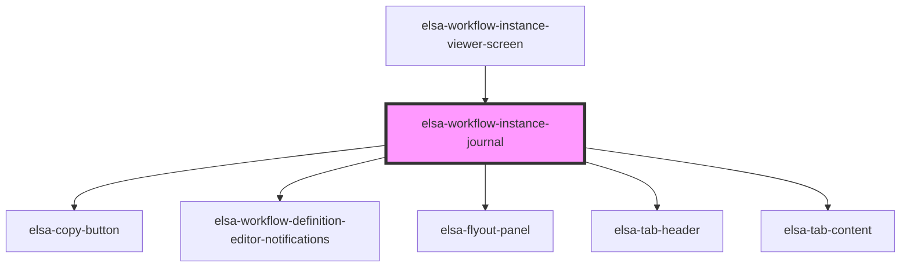

# elsa-workflow-instance-journal

<!-- Auto Generated Below -->

## Properties

| Property              | Attribute              | Description | Type                   | Default     |
| --------------------- | ---------------------- | ----------- | ---------------------- | ----------- |
| `activityDescriptors` | --                     |             | `ActivityDescriptor[]` | `[]`        |
| `serverUrl`           | `server-url`           |             | `string`               | `undefined` |
| `workflowBlueprint`   | --                     |             | `WorkflowBlueprint`    | `undefined` |
| `workflowInstance`    | --                     |             | `WorkflowInstance`     | `undefined` |
| `workflowInstanceId`  | `workflow-instance-id` |             | `string`               | `undefined` |
| `workflowModel`       | --                     |             | `WorkflowModel`        | `undefined` |

## Events

| Event            | Description | Type                                      |
| ---------------- | ----------- | ----------------------------------------- |
| `recordSelected` |             | `CustomEvent<WorkflowExecutionLogRecord>` |

## Methods

### `selectActivityRecord(activityId?: string) => Promise<void>`

#### Returns

Type: `Promise<void>`

## Dependencies

### Used by

 - [elsa-workflow-instance-viewer-screen](../elsa-workflow-instance-viewer-screen)

### Depends on

- [elsa-copy-button](../../../shared/elsa-copy-button)
- [elsa-workflow-definition-editor-notifications](../../workflow-definition-editor/elsa-workflow-definition-editor-notifications)
- [elsa-flyout-panel](../../../shared/elsa-flyout-panel)
- [elsa-tab-header](../../../shared/elsa-tab-header)
- [elsa-tab-content](../../../shared/elsa-tab-content)

### Graph

----------------------------------------------

*Built with [StencilJS](https://stenciljs.com/)*
