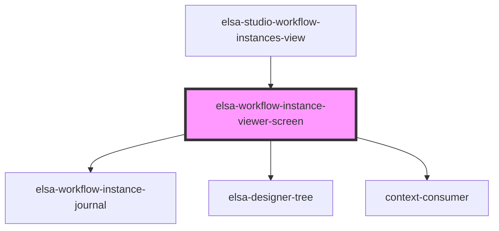

# elsa-workflow-instance-viewer-screen

<!-- Auto Generated Below -->

## Properties

| Property             | Attribute              | Description | Type     | Default     |
| -------------------- | ---------------------- | ----------- | -------- | ----------- |
| `culture`            | `culture`              |             | `string` | `undefined` |
| `serverUrl`          | `server-url`           |             | `string` | `undefined` |
| `workflowInstanceId` | `workflow-instance-id` |             | `string` | `undefined` |

## Methods

### `getServerUrl() => Promise<string>`

#### Returns

Type: `Promise<string>`

## Dependencies

### Used by

 - [elsa-studio-workflow-instances-view](../../../dashboard/pages/elsa-studio-workflow-instances-view)

### Depends on

- [elsa-workflow-instance-journal](../elsa-workflow-instance-journal)
- [elsa-designer-tree](../../../designers/tree/elsa-designer-tree)
- context-consumer

### Graph

----------------------------------------------

*Built with [StencilJS](https://stenciljs.com/)*
