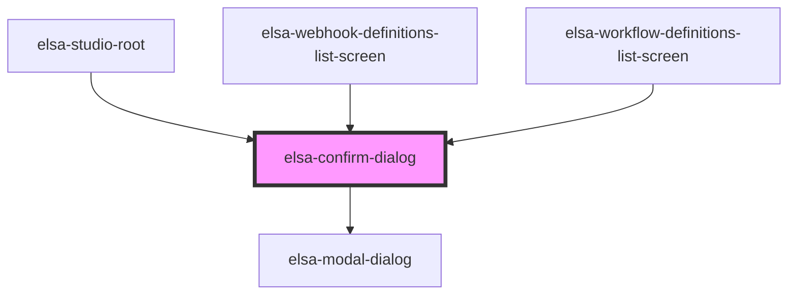

# elsa-confirm-dialog

<!-- Auto Generated Below -->

## Properties

| Property  | Attribute | Description | Type     | Default     |
| --------- | --------- | ----------- | -------- | ----------- |
| `culture` | `culture` |             | `string` | `undefined` |

## Methods

### `hide() => Promise<void>`

#### Returns

Type: `Promise<void>`

### `show(caption: string, message: string) => Promise<boolean>`

#### Returns

Type: `Promise<boolean>`

## Dependencies

### Used by

 - [elsa-studio-root](../../dashboard/pages/elsa-studio-root)
 - [elsa-webhook-definitions-list-screen](../../screens/webhook-definition-list/else-webhook-definitions-screen)
 - [elsa-workflow-definitions-list-screen](../../screens/workflow-definition-list/elsa-workflow-definitions-screen)

### Depends on

- [elsa-modal-dialog](../elsa-modal-dialog)

### Graph

----------------------------------------------

*Built with [StencilJS](https://stenciljs.com/)*
