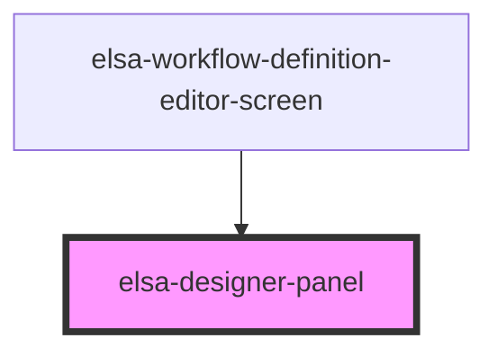

# elsa-designer-panel

<!-- Auto Generated Below -->

## Properties

| Property  | Attribute | Description | Type     | Default     |
| --------- | --------- | ----------- | -------- | ----------- |
| `culture` | `culture` |             | `string` | `undefined` |

## Events

| Event                  | Description | Type                  |
| ---------------------- | ----------- | --------------------- |
| `featureChanged`       |             | `CustomEvent<string>` |
| `featureStatusChanged` |             | `CustomEvent<string>` |

## Dependencies

### Used by

 - [elsa-workflow-definition-editor-screen](../../screens/workflow-definition-editor/elsa-workflow-definition-editor-screen)

### Graph

----------------------------------------------

*Built with [StencilJS](https://stenciljs.com/)*
