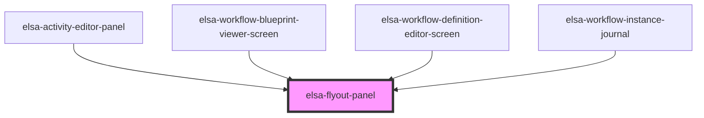

# elsa-flyout-panel

<!-- Auto Generated Below -->

## Properties

| Property               | Attribute                | Description | Type      | Default |
| ---------------------- | ------------------------ | ----------- | --------- | ------- |
| `autoExpand`           | `auto-expand`            |             | `boolean` | `false` |
| `expandButtonPosition` | `expand-button-position` |             | `number`  | `1`     |
| `hidden`               | `hidden`                 |             | `boolean` | `false` |
| `silent`               | `silent`                 |             | `boolean` | `false` |
| `updateCounter`        | `update-counter`         |             | `number`  | `0`     |

## Methods

### `selectTab(tab: string, expand?: boolean) => Promise<void>`

#### Returns

Type: `Promise<void>`

## Dependencies

### Used by

 - [elsa-activity-editor-panel](../../screens/workflow-definition-editor/elsa-activity-editor-panel)
 - [elsa-workflow-blueprint-viewer-screen](../../screens/workflow-blueprint-viewer/elsa-workflow-blueprint-viewer-screen)
 - [elsa-workflow-definition-editor-screen](../../screens/workflow-definition-editor/elsa-workflow-definition-editor-screen)
 - [elsa-workflow-instance-journal](../../screens/workflow-instance-viewer/elsa-workflow-instance-journal)

### Graph

----------------------------------------------

*Built with [StencilJS](https://stenciljs.com/)*
