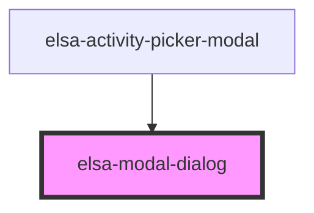

# elsa-modal-dialog

<!-- Auto Generated Below -->

## Methods

### `hide() => Promise<void>`

#### Returns

Type: `Promise<void>`

### `show() => Promise<void>`

#### Returns

Type: `Promise<void>`

## Dependencies

### Used by

 - [elsa-activity-picker-modal](../../pickers/modal/elsa-activity-picker-modal)

### Graph

----------------------------------------------

*Built with [StencilJS](https://stenciljs.com/)*
