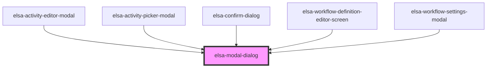

# elsa-modal-dialog

<!-- Auto Generated Below -->

## Events

| Event    | Description | Type               |
| -------- | ----------- | ------------------ |
| `hidden` |             | `CustomEvent<any>` |
| `shown`  |             | `CustomEvent<any>` |

## Methods

### `hide(animate?: boolean) => Promise<void>`

#### Returns

Type: `Promise<void>`

### `show(animate?: boolean) => Promise<void>`

#### Returns

Type: `Promise<void>`

## Dependencies

### Used by

 - [elsa-activity-editor-modal](../../screens/workflow-definition-editor/elsa-activity-editor-modal)
 - [elsa-activity-picker-modal](../../screens/workflow-definition-editor/elsa-activity-picker-modal)
 - [elsa-confirm-dialog](../elsa-confirm-dialog)
 - [elsa-workflow-definition-editor-screen](../../screens/workflow-definition-editor/elsa-workflow-definition-editor-screen)
 - [elsa-workflow-settings-modal](../../screens/workflow-definition-editor/elsa-workflow-settings-modal)

### Graph

----------------------------------------------

*Built with [StencilJS](https://stenciljs.com/)*
