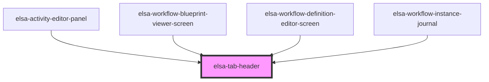

# elsa-tab-header

<!-- Auto Generated Below -->

## Properties

| Property | Attribute | Description | Type      | Default     |
| -------- | --------- | ----------- | --------- | ----------- |
| `active` | `active`  |             | `boolean` | `undefined` |
| `tab`    | `tab`     |             | `string`  | `undefined` |

## Dependencies

### Used by

 - [elsa-activity-editor-panel](../../screens/workflow-definition-editor/elsa-activity-editor-panel)
 - [elsa-workflow-blueprint-viewer-screen](../../screens/workflow-blueprint-viewer/elsa-workflow-blueprint-viewer-screen)
 - [elsa-workflow-definition-editor-screen](../../screens/workflow-definition-editor/elsa-workflow-definition-editor-screen)
 - [elsa-workflow-instance-journal](../../screens/workflow-instance-viewer/elsa-workflow-instance-journal)

### Graph

----------------------------------------------

*Built with [StencilJS](https://stenciljs.com/)*
