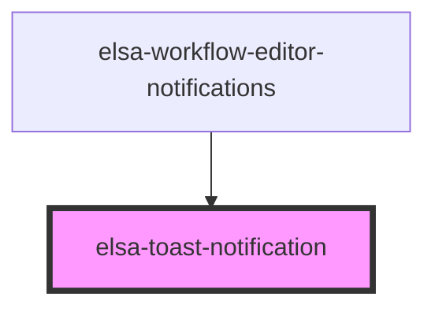

# elsa-toast-notification

<!-- Auto Generated Below -->

## Methods

### `hide() => Promise<void>`

#### Returns

Type: `Promise<void>`

### `show(options: ToastNotificationOptions) => Promise<void>`

#### Returns

Type: `Promise<void>`

## Dependencies

### Used by

 - [elsa-workflow-editor-notifications](../../editors/workflow-editor/elsa-workflow-editor-notifications)

### Graph

----------------------------------------------

*Built with [StencilJS](https://stenciljs.com/)*
