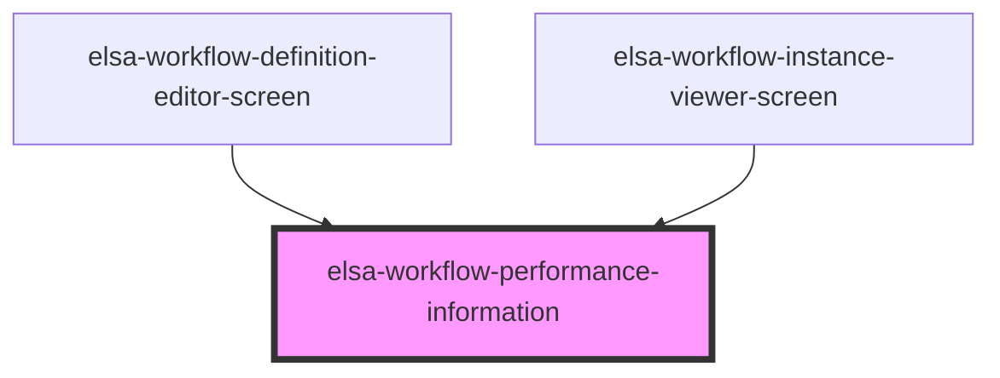

# elsa-workflow-performance-information

<!-- Auto Generated Below -->

## Properties

| Property        | Attribute | Description | Type            | Default     |
| --------------- | --------- | ----------- | --------------- | ----------- |
| `activityStats` | --        |             | `ActivityStats` | `undefined` |

## Dependencies

### Used by

 - [elsa-workflow-definition-editor-screen](../../screens/workflow-definition-editor/elsa-workflow-definition-editor-screen)
 - [elsa-workflow-instance-viewer-screen](../../screens/workflow-instance-viewer/elsa-workflow-instance-viewer-screen)

### Graph

----------------------------------------------

*Built with [StencilJS](https://stenciljs.com/)*
