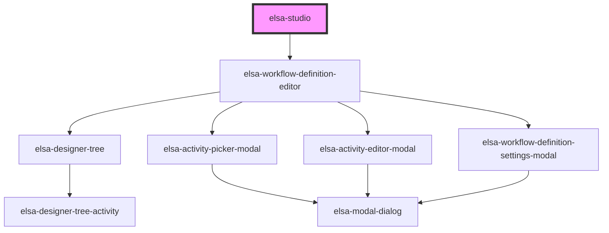

# elsa-studio

<!-- Auto Generated Below -->

## Properties

| Property               | Attribute                | Description | Type     | Default     |
| ---------------------- | ------------------------ | ----------- | -------- | ----------- |
| `serverUrl`            | `server-url`             |             | `string` | `undefined` |
| `workflowDefinitionId` | `workflow-definition-id` |             | `string` | `undefined` |

## Dependencies

### Depends on

- [elsa-workflow-definition-editor](../elsa-workflow-definition-editor)

### Graph

----------------------------------------------

*Built with [StencilJS](https://stenciljs.com/)*
