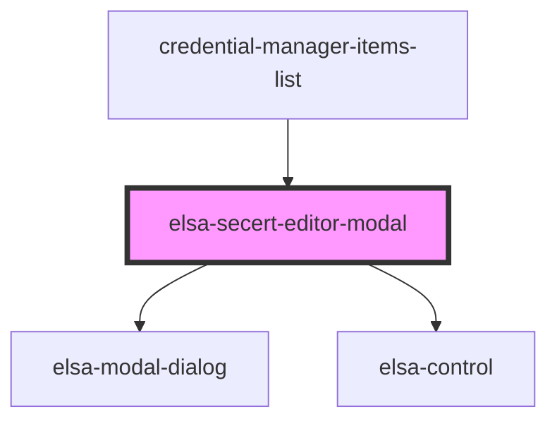

# elsa-secert-editor-modal

<!-- Auto Generated Below -->

## Properties

| Property  | Attribute | Description | Type     | Default     |
| --------- | --------- | ----------- | -------- | ----------- |
| `culture` | `culture` |             | `string` | `undefined` |

## Dependencies

### Used by

 - [credential-manager-items-list](../pages)

### Depends on

- [elsa-modal-dialog](../../../components/shared/elsa-modal-dialog)
- [elsa-control](../../../components/controls/elsa-control)

### Graph

----------------------------------------------

*Built with [StencilJS](https://stenciljs.com/)*
