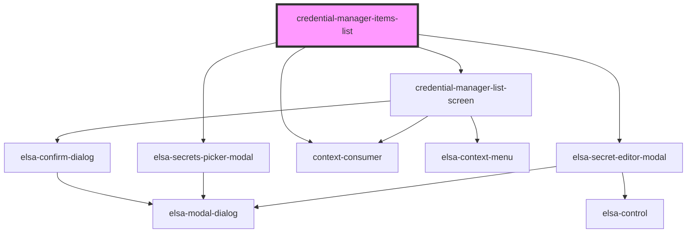

# credential-manager-items-list

<!-- Auto Generated Below -->

## Properties

| Property   | Attribute   | Description | Type     | Default     |
| ---------- | ----------- | ----------- | -------- | ----------- |
| `basePath` | `base-path` |             | `string` | `undefined` |
| `culture`  | `culture`   |             | `string` | `undefined` |

## Dependencies

### Depends on

- [credential-manager-list-screen](../components)
- [elsa-secrets-picker-modal](../elsa-secrets-picker-modal)
- [elsa-secret-editor-modal](../elsa-secret-editor-model)
- context-consumer

### Graph

----------------------------------------------

*Built with [StencilJS](https://stenciljs.com/)*
