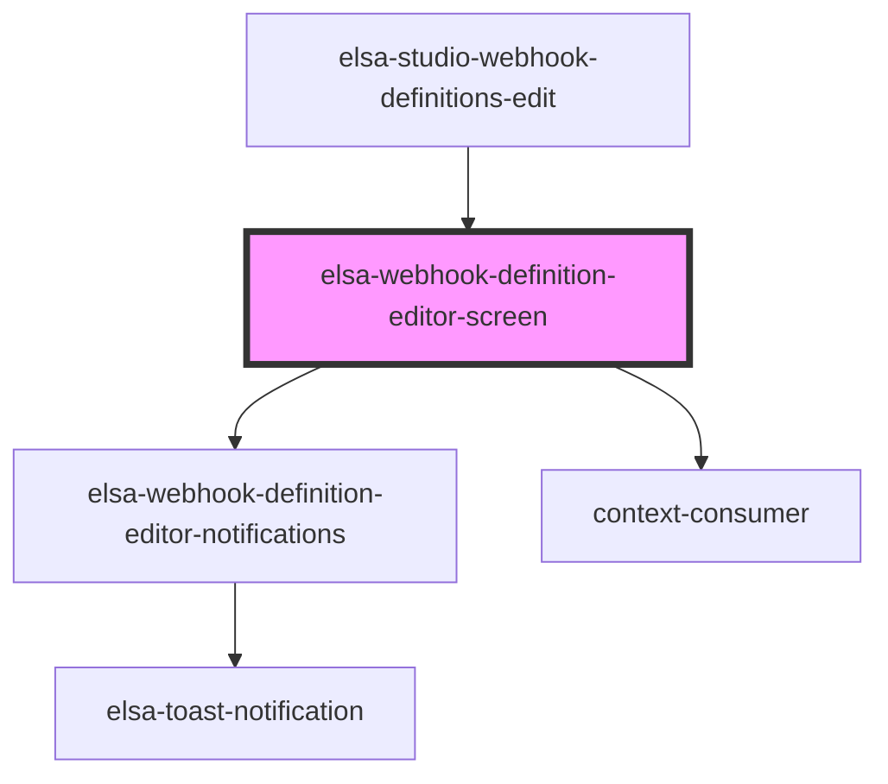

# elsa-webhook-settings-modal

<!-- Auto Generated Below -->

## Properties

| Property            | Attribute               | Description | Type                | Default     |
| ------------------- | ----------------------- | ----------- | ------------------- | ----------- |
| `culture`           | `culture`               |             | `string`            | `undefined` |
| `history`           | --                      |             | `RouterHistory`     | `undefined` |
| `serverUrl`         | `server-url`            |             | `string`            | `undefined` |
| `webhookDefinition` | --                      |             | `WebhookDefinition` | `undefined` |
| `webhookId`         | `webhook-definition-id` |             | `string`            | `undefined` |

## Methods

### `getServerUrl() => Promise<string>`

#### Returns

Type: `Promise<string>`

### `getWebhookId() => Promise<string>`

#### Returns

Type: `Promise<string>`

## Dependencies

### Used by

 - [elsa-studio-webhook-definitions-edit](../../../dashboard/pages/elsa-studio-webhook-definitions-edit)

### Depends on

- [elsa-webhook-definition-editor-notifications](../elsa-webhook-definition-editor-notifications)
- context-consumer

### Graph

----------------------------------------------

*Built with [StencilJS](https://stenciljs.com/)*
