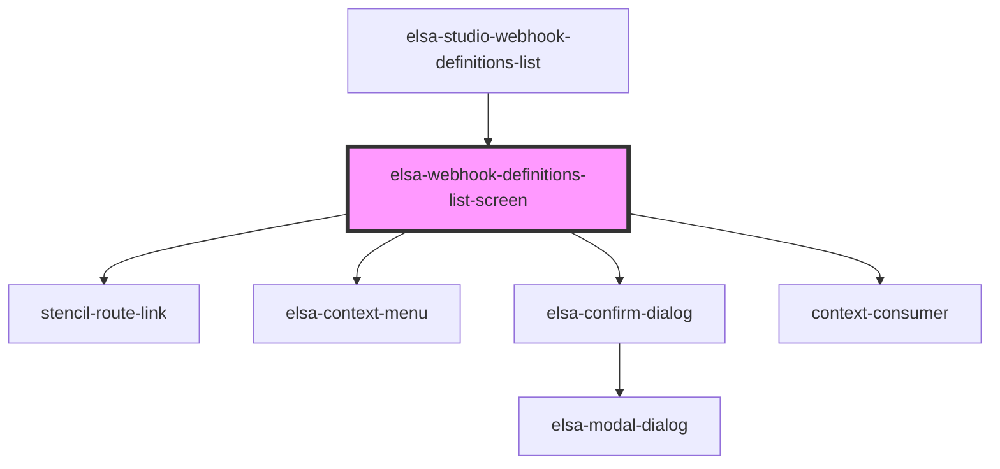

# elsa-webhook-definitions-list-screen

<!-- Auto Generated Below -->

## Properties

| Property    | Attribute    | Description | Type            | Default     |
| ----------- | ------------ | ----------- | --------------- | ----------- |
| `basePath`  | `base-path`  |             | `string`        | `undefined` |
| `culture`   | `culture`    |             | `string`        | `undefined` |
| `history`   | --           |             | `RouterHistory` | `undefined` |
| `serverUrl` | `server-url` |             | `string`        | `undefined` |

## Dependencies

### Used by

 - [elsa-studio-webhook-definitions-list](../../../dashboard/pages/elsa-studio-webhook-definitions-list)

### Depends on

- stencil-route-link
- [elsa-context-menu](../../../controls/elsa-context-menu)
- [elsa-confirm-dialog](../../../shared/elsa-confirm-dialog)
- context-consumer

### Graph

----------------------------------------------

*Built with [StencilJS](https://stenciljs.com/)*
